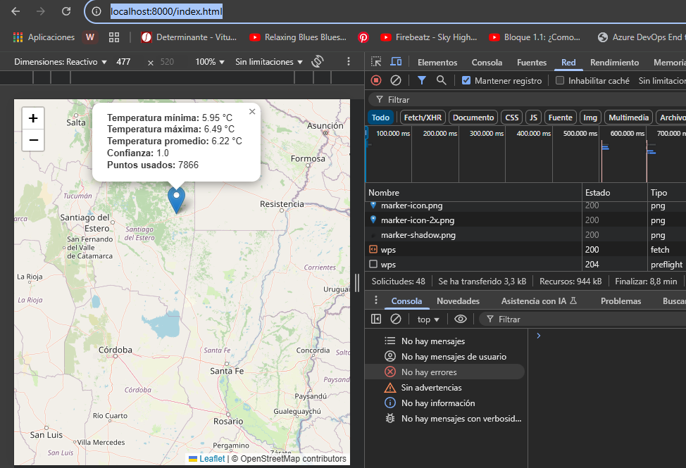

# WPS Temperatura MODIS - Despliegue Local

Este proyecto permite consultar el rango de temperaturas MODIS en cualquier punto seleccionado sobre un mapa web, utilizando un servicio OGC WPS propio.

En este proyecto se implementaron dos enfoques diferentes para exponer un servicio de consulta de temperatura MODIS a partir de la selección de un punto en un mapa web:

* (A) FastAPI: Solución API REST personalizada
* (B) PyWPS: Solución estándar OGC WPS

# FastAPI*
Se creó un endpoint REST (por ejemplo, /api/temperatura) que recibe latitud, longitud y radio vía JSON o parámetros de URL.
El endpoint ejecuta la lógica de consulta/interpolación sobre la base de datos MODIS y retorna los resultados en formato JSON.
El visor web (HTML+Leaflet) hace peticiones AJAX (fetch) directas a este endpoint, recibe la respuesta y muestra los datos en el mapa.
- Ventajas: Sencillez, control total sobre el formato de entrada/salida, fácil integración con aplicaciones modernas.
- Desventajas: No es un estándar geoespacial interoperable, requiere mantener la lógica de API y de negocio.
# PyWPS*
Se implementó un proceso WPS conforme al estándar OGC, exponiendo el proceso temperatura_modis con inputs (lat, lon, radio) y outputs (temperaturas, confianza, etc).
El visor web construye una petición XML WPS Execute y la envía al endpoint /wps del servidor PyWPS.
El proceso WPS ejecuta la lógica de consulta/interpolación y responde con un documento XML estructurado según el estándar WPS.
- Ventajas: Interoperabilidad OGC, integración directa con clientes GIS (QGIS, gvSIG, etc.), separación clara entre lógica geoespacial y presentación.
- Desventajas: Mayor complejidad inicial, manejo de XML, configuración de CORS para consumo web moderno.

## Requisitos

- **Python 3.10+**
- **pip** (gestor de paquetes de Python)
- **PostgreSQL** (si usas base de datos para el proceso WPS)
- **Navegador web** (Chrome, Firefox, Edge, etc.)

---

## Instalación de dependencias
Desde la carpeta raíz del proyecto (`wps/pyWPS`):

Instala dependencias:
```
pip install pywps waitress wsgicors psycopg2 numpy
```

### 1. Interfaz Web
Luego ejecuta:
```
python -m http.server 8000
```
Esto sirve la interfaz en [http://localhost:8000/index.html](http://localhost:8000/index.html).

### 2. Server xml wps
En otra terminal, levanta el servicio WPS en [http://localhost:5000/wps](http://localhost:5000/wps).

**Nota:** Si usas CORS, asegúrate de que tu `wps_server.py` incluya el middleware `wsgi-cors`:

```
rom wsgicors import CORS
application = CORS(application, headers="*", methods="GET,POST,OPTIONS", origin="*")
```

### 3. Uso

1. Abre [http://localhost:8000/index.html](http://localhost:8000/index.html) en tu navegador.
2. Haz click en cualquier punto del mapa.
3. Se mostrará un popup con el rango de temperaturas MODIS estimado para ese sitio.
 

### 4. Notas y problemas comunes

- **CORS:** Si ves errores CORS en el navegador, asegúrate de tener el middleware `wsgi-cors` activo en el servidor WPS.
- **Puertos:** El WPS debe correr en el puerto 5000 y el servidor HTTP en el 8000 (o ajusta las URLs en el código si cambias los puertos).
- **Base de datos:** El proceso WPS requiere acceso a la base de datos PostgreSQL configurada en el proceso Python.
- **Logs:** Si algo falla, revisa la consola donde ejecutas `waitress-serve` para ver mensajes de error detallados.

## Sevicio
- PyWPS
- Leaflet.js
- OpenStreetMap